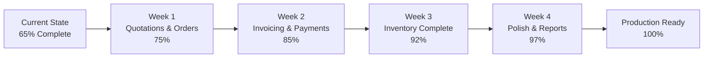

# Enxi ERP - System Completion Status

## Overall Progress: 65% Complete

### Module Completion Status

```
Sales & CRM Module
├── Lead Management          ████████████████████ 100% ✅
├── Customer Management      ██████████████████░░  90% ✅
├── Sales Cases             █████████████████░░░  85% ✅
├── Quotations              ██████████░░░░░░░░░░  50% 🔴 (Backend only)
├── Sales Orders            ██████████░░░░░░░░░░  50% 🔴 (Backend only)
└── Customer POs            ████████████████░░░░  80% 🟡

Financial Module
├── Chart of Accounts       ██████████████████░░  90% ✅
├── Journal Entries         ████████████████████ 100% ✅
├── Financial Reports       ████████████████████ 100% ✅
├── Invoicing              ██████████░░░░░░░░░░  50% 🔴 (Backend only)
├── Payments               ██████████░░░░░░░░░░  50% 🔴 (Backend only)
└── Multi-currency         ████████░░░░░░░░░░░░  40% 🔴

Inventory Module  
├── Categories             ████████████████████ 100% ✅
├── Items/Products         ██████████████░░░░░░  70% 🟡
├── Stock Movements        ████████████░░░░░░░░  60% 🟡
├── Stock Valuation        ██████████░░░░░░░░░░  50% 🔴 (Backend only)
├── Units of Measure       ██████████░░░░░░░░░░  50% 🔴 (Backend only)
└── Inventory Reports      ████████░░░░░░░░░░░░  40% 🔴

System & Admin
├── Authentication         ████████████████████ 100% ✅
├── Audit Trail           ████████████████████ 100% ✅
├── Debug System          ████████████████████ 100% ✅
├── Health Monitoring     ████████████████████ 100% ✅
├── User Management       ████████░░░░░░░░░░░░  40% 🔴
└── Permissions           ████░░░░░░░░░░░░░░░░  20% 🔴
```

## Critical Path to Completion

### 🚨 Week 1 Priority - Quote to Cash Cycle
1. **Quotations UI** (Currently 0% → Target 100%)
   - List page with search/filter
   - Create/Edit forms  
   - PDF preview
   - Version management

2. **Sales Orders UI** (Currently 0% → Target 100%)
   - Order list and management
   - Approval workflow
   - Order fulfillment tracking

### 🚨 Week 2 Priority - Financial Operations  
3. **Invoicing UI** (Currently 0% → Target 100%)
   - Invoice generation
   - Invoice management
   - PDF templates
   - Email delivery

4. **Payments UI** (Currently 10% → Target 100%)
   - Payment recording
   - Allocation to invoices
   - Customer statements
   - Payment history

### 📋 Week 3-4 - Inventory & Enhancements
5. **Complete Inventory UI** (Currently 60% → Target 100%)
6. **Reports Dashboard** (Currently 20% → Target 80%)
7. **User Management** (Currently 0% → Target 70%)

## Development Velocity Estimate

Based on existing code patterns:
- **1 Developer**: 6-8 weeks to 100% completion
- **2 Developers**: 3-4 weeks to 100% completion
- **Current Pace**: ~10-15% completion per week

## Technical Debt & Risks

### Low Risk ✅
- Database schema is production-ready
- API layer is well-tested
- Authentication is secure
- Audit system is comprehensive

### Medium Risk 🟡  
- No automated tests for new UI components
- Limited error handling in some services
- No database backup strategy
- Single-tenant architecture

### High Risk 🔴
- No email integration (required for invoices)
- No payment gateway integration
- No data migration tools
- Limited concurrent user testing

## Quick Wins (Can be done in 1 day each)

1. ✨ Add Quotation list page
2. ✨ Create Invoice list page  
3. ✨ Add Payment recording form
4. ✨ Complete Item create/edit forms
5. ✨ Add Stock movement page
6. ✨ Create basic user management page

## Recommended Implementation Order



## Conclusion

The system has **excellent bones** - the hard architectural work is done. What remains is primarily **UI implementation** following established patterns. The backend APIs are ready and tested. With focused effort on the Quote-to-Cash UI components, the system can be operational for core business processes within **2 weeks**, and fully complete within **4-6 weeks**.

**Immediate Action**: Start with Quotation UI as it unlocks the entire sales cycle.