# Test Driven Development Implementation Plan
## Frontend Gap Resolution with Dependency-Aware Ordering

## Overview
This plan implements the missing frontend modules using TDD methodology, ensuring no dependency breaks and complete integration. We'll build from the foundation up, with each phase depending on the previous one.

## TDD Methodology
1. **Red**: Write failing tests first
2. **Green**: Write minimal code to make tests pass
3. **Refactor**: Improve code while keeping tests green
4. Iterate until feature is complete

## Dependency Hierarchy Analysis

```mermaid
graph TD
    A[Inventory Items & Categories] --> B[Stock Movements]
    B --> C[FIFO Cost Calculations]
    A --> D[Quotation Line Items]
    C --> D
    D --> E[Quotations Module]
    E --> F[Customer PO Recording]
    F --> G[Sales Orders]
    G --> H[Delivery Management]
    H --> I[Invoice Generation]
    I --> J[Payment Recording]
    E --> K[Sales Case Integration]
    B --> L[GL Integration]
    I --> L
    J --> L
    K --> M[Profitability Analysis]
    L --> M
```



## Phase 1: Foundation Layer (Week 1-2)
### 1.1 Inventory Categories (No Dependencies)

**Test Files to Create:**
```
tests/components/inventory/category-tree.test.tsx
tests/components/inventory/category-form.test.tsx
tests/pages/inventory/categories.test.tsx
tests/integration/inventory-categories.test.ts
```

**TDD Cycle 1.1.1: Category Tree Component**
```typescript
// tests/components/inventory/category-tree.test.tsx
describe('CategoryTree', () => {
  it('should render empty state when no categories', () => {
    render(<CategoryTree categories={[]} />)
    expect(screen.getByText('No categories found')).toBeInTheDocument()
  })

  it('should render category hierarchy', () => {
    const categories = [
      { id: '1', name: 'Electronics', parentId: null, children: [] },
      { id: '2', name: 'Computers', parentId: '1', children: [] }
    ]
    render(<CategoryTree categories={categories} />)
    expect(screen.getByText('Electronics')).toBeInTheDocument()
    expect(screen.getByText('Computers')).toBeInTheDocument()
  })

  it('should allow drag and drop reordering', async () => {
    // Test drag and drop functionality
  })
})
```

**Implementation Order:**
1. Create failing test
2. Build minimal CategoryTree component
3. Add drag-drop functionality
4. Refactor and optimize

**Files to Implement:**
```
/components/inventory/category-tree.tsx
/components/inventory/category-form.tsx
/app/(auth)/inventory/categories/page.tsx
/lib/hooks/use-categories.ts
```

### 1.2 Inventory Items (Depends on Categories)

**TDD Cycle 1.2.1: Item Form with Category Selection**
```typescript
// tests/components/inventory/item-form.test.tsx
describe('ItemForm', () => {
  beforeEach(() => {
    mockCategories([
      { id: '1', name: 'Electronics', path: 'Electronics' }
    ])
  })

  it('should validate required fields', async () => {
    render(<ItemForm onSubmit={mockSubmit} />)
    fireEvent.click(screen.getByRole('button', { name: 'Save' }))
    
    await waitFor(() => {
      expect(screen.getByText('SKU is required')).toBeInTheDocument()
      expect(screen.getByText('Name is required')).toBeInTheDocument()
    })
  })

  it('should auto-generate SKU when requested', async () => {
    render(<ItemForm onSubmit={mockSubmit} />)
    fireEvent.click(screen.getByText('Auto-generate SKU'))
    
    await waitFor(() => {
      expect(screen.getByDisplayValue(/^ITM-/)).toBeInTheDocument()
    })
  })
})
```

### 1.3 Stock Movements (Depends on Items)

**TDD Cycle 1.3.1: Stock Movement Recording**
```typescript
// tests/components/inventory/stock-movement-form.test.tsx
describe('StockMovementForm', () => {
  it('should calculate total amount correctly', () => {
    render(<StockMovementForm type="IN" />)
    
    fireEvent.change(screen.getByLabelText('Quantity'), { target: { value: '10' }})
    fireEvent.change(screen.getByLabelText('Unit Cost'), { target: { value: '25.50' }})
    
    expect(screen.getByDisplayValue('255.00')).toBeInTheDocument()
  })

  it('should create GL entries preview for stock in', () => {
    render(<StockMovementForm type="IN" />)
    
    // Fill form
    expect(screen.getByText('GL Preview:')).toBeInTheDocument()
    expect(screen.getByText('Dr. Inventory Asset')).toBeInTheDocument()
    expect(screen.getByText('Cr. Accounts Payable')).toBeInTheDocument()
  })
})
```

## Phase 2: Quotation Foundation (Week 3)
### 2.1 Line Item Editor (Depends on Inventory Items)

**TDD Cycle 2.1.1: Multi-Line Editor**
```typescript
// tests/components/quotations/line-item-editor.test.tsx
describe('LineItemEditor', () => {
  it('should add new line when button clicked', () => {
    render(<LineItemEditor lines={[]} onChange={mockChange} />)
    
    fireEvent.click(screen.getByText('Add Line'))
    
    expect(mockChange).toHaveBeenCalledWith([
      expect.objectContaining({
        description: '',
        items: [],
        sequence: 1
      })
    ])
  })

  it('should allow adding inventory items to line', async () => {
    const lines = [{ id: '1', description: 'Test Line', items: [] }]
    render(<LineItemEditor lines={lines} onChange={mockChange} />)
    
    fireEvent.click(screen.getByText('Add Item'))
    fireEvent.click(screen.getByText('ITM-001 - Test Item'))
    
    await waitFor(() => {
      expect(mockChange).toHaveBeenCalledWith(
        expect.arrayContaining([
          expect.objectContaining({
            items: expect.arrayContaining([
              expect.objectContaining({
                type: 'inventory',
                itemId: 'ITM-001'
              })
            ])
          })
        ])
      )
    })
  })

  it('should calculate line totals correctly', () => {
    const lines = [{
      id: '1',
      description: 'Test',
      items: [
        { quantity: 2, unitPrice: 10, taxRate: 0.1 }
      ]
    }]
    
    render(<LineItemEditor lines={lines} onChange={mockChange} />)
    
    expect(screen.getByText('$22.00')).toBeInTheDocument() // 20 + 2 tax
  })
})
```

### 2.2 Quotation Form (Depends on Line Editor)

**TDD Cycle 2.2.1: Quotation Creation**
```typescript
// tests/components/quotations/quotation-form.test.tsx
describe('QuotationForm', () => {
  it('should create quotation from sales case', async () => {
    const salesCase = { id: 'SC-001', customerId: 'CUST-001' }
    render(<QuotationForm salesCase={salesCase} />)
    
    expect(screen.getByDisplayValue('CUST-001')).toBeInTheDocument()
    expect(screen.getByDisplayValue('SC-001')).toBeInTheDocument()
  })

  it('should validate quotation before submission', async () => {
    render(<QuotationForm onSubmit={mockSubmit} />)
    
    fireEvent.click(screen.getByText('Save Quotation'))
    
    await waitFor(() => {
      expect(screen.getByText('Customer is required')).toBeInTheDocument()
      expect(screen.getByText('At least one line item is required')).toBeInTheDocument()
    })
  })
})
```

### 2.3 Dual View System (Depends on Quotation Form)

**TDD Cycle 2.3.1: Client vs Internal Views**
```typescript
// tests/components/quotations/quotation-preview.test.tsx
describe('QuotationPreview', () => {
  const quotation = {
    lines: [{
      description: 'Software Development',
      items: [
        { description: 'Frontend Development', quantity: 40, unitPrice: 100 },
        { description: 'Backend Development', quantity: 20, unitPrice: 120 }
      ]
    }]
  }

  it('should show only descriptions in client view', () => {
    render(<QuotationPreview quotation={quotation} view="client" />)
    
    expect(screen.getByText('Software Development')).toBeInTheDocument()
    expect(screen.queryByText('Frontend Development')).not.toBeInTheDocument()
    expect(screen.queryByText('Backend Development')).not.toBeInTheDocument()
  })

  it('should show full breakdown in internal view', () => {
    render(<QuotationPreview quotation={quotation} view="internal" />)
    
    expect(screen.getByText('Software Development')).toBeInTheDocument()
    expect(screen.getByText('Frontend Development')).toBeInTheDocument()
    expect(screen.getByText('Backend Development')).toBeInTheDocument()
  })
})
```

## Phase 3: Sales Case Integration (Week 4)
### 3.1 Sales Case Quotation Tab (Depends on Quotation Module)

**TDD Cycle 3.1.1: Integration Testing**
```typescript
// tests/integration/sales-case-quotations.test.ts
describe('Sales Case Quotations Integration', () => {
  it('should create quotation from sales case page', async () => {
    await testSetup.createSalesCase('SC-001')
    
    const { user } = renderWithAuth(<SalesCaseDetail id="SC-001" />)
    
    await user.click(screen.getByText('Quotations'))
    await user.click(screen.getByText('Create Quotation'))
    
    expect(screen.getByText('New Quotation for SC-001')).toBeInTheDocument()
  })

  it('should list quotations for sales case', async () => {
    await testSetup.createQuotation('Q-001', { salesCaseId: 'SC-001' })
    
    render(<SalesCaseDetail id="SC-001" />)
    
    expect(screen.getByText('Q-001')).toBeInTheDocument()
    expect(screen.getByText('Draft')).toBeInTheDocument()
  })
})
```

## Phase 4: Order Management (Week 5)
### 4.1 Customer PO Recording (Depends on Quotations)

**TDD Cycle 4.1.1: PO Workflow**
```typescript
// tests/components/customer-pos/po-form.test.tsx
describe('CustomerPOForm', () => {
  it('should accept quotation and create PO', async () => {
    const quotation = { id: 'Q-001', status: 'sent' }
    render(<CustomerPOForm quotation={quotation} />)
    
    await user.type(screen.getByLabelText('PO Number'), 'PO-12345')
    await user.selectOptions(screen.getByLabelText('PO Type'), 'written')
    await user.upload(screen.getByLabelText('PO File'), file)
    
    await user.click(screen.getByText('Record PO'))
    
    await waitFor(() => {
      expect(mockCreatePO).toHaveBeenCalledWith(
        expect.objectContaining({
          quotationId: 'Q-001',
          poNumber: 'PO-12345',
          type: 'written'
        })
      )
    })
  })
})
```

### 4.2 Sales Order Generation (Depends on PO)

**TDD Cycle 4.2.1: Order from Quotation**
```typescript
// tests/components/orders/order-creation.test.tsx
describe('OrderCreation', () => {
  it('should auto-create order when PO accepted', async () => {
    const quotation = { id: 'Q-001', lines: [{ items: [{ quantity: 10 }] }] }
    
    mockAPIResponse('/api/quotations/Q-001/convert-to-order', { orderId: 'ORD-001' })
    
    render(<QuotationDetail quotation={quotation} />)
    
    await user.click(screen.getByText('Convert to Order'))
    
    expect(screen.getByText('Order ORD-001 created successfully')).toBeInTheDocument()
  })
})
```

## Phase 5: Financial Integration (Week 6-7)
### 5.1 FIFO Cost Integration

**TDD Cycle 5.1.1: Cost Calculation**
```typescript
// tests/services/fifo-costing.test.ts
describe('FIFOCostingService', () => {
  it('should calculate FIFO cost for sales', () => {
    const costLayers = [
      { date: '2024-01-01', quantity: 10, unitCost: 5, remaining: 8 },
      { date: '2024-01-15', quantity: 15, unitCost: 6, remaining: 15 }
    ]
    
    const result = fifoCostingService.calculateCost(costLayers, 12)
    
    expect(result).toEqual({
      totalCost: 64, // (8 * 5) + (4 * 6)
      layersUsed: [
        { layerId: 1, quantityUsed: 8, cost: 40 },
        { layerId: 2, quantityUsed: 4, cost: 24 }
      ]
    })
  })
})
```

### 5.2 GL Integration UI

**TDD Cycle 5.2.1: GL Preview Component**
```typescript
// tests/components/accounting/gl-preview.test.tsx
describe('GLPreview', () => {
  it('should show balanced journal entries', () => {
    const entries = [
      { account: '1200', accountName: 'Inventory', debit: 1000, credit: 0 },
      { account: '2100', accountName: 'Accounts Payable', debit: 0, credit: 1000 }
    ]
    
    render(<GLPreview entries={entries} />)
    
    expect(screen.getByText('Total Debits: $1,000.00')).toBeInTheDocument()
    expect(screen.getByText('Total Credits: $1,000.00')).toBeInTheDocument()
    expect(screen.getByText('✓ Balanced')).toBeInTheDocument()
  })
})
```

## Phase 6: Invoicing & Payments (Week 8)
### 6.1 Invoice Generation

**TDD Cycle 6.1.1: Invoice from Order**
```typescript
// tests/components/invoices/invoice-generator.test.tsx
describe('InvoiceGenerator', () => {
  it('should create invoice from completed delivery', async () => {
    const delivery = { 
      orderId: 'ORD-001',
      items: [{ itemId: 'ITM-001', quantity: 5, deliveredQuantity: 5 }]
    }
    
    render(<InvoiceGenerator delivery={delivery} />)
    
    await user.click(screen.getByText('Generate Invoice'))
    
    expect(screen.getByText('Invoice created successfully')).toBeInTheDocument()
  })
})
```

### 6.2 Payment Recording

**TDD Cycle 6.2.1: Payment Allocation**
```typescript
// tests/components/payments/payment-allocation.test.tsx
describe('PaymentAllocation', () => {
  it('should auto-allocate payment to oldest invoices', () => {
    const invoices = [
      { id: 'INV-001', balance: 500, dueDate: '2024-01-01' },
      { id: 'INV-002', balance: 300, dueDate: '2024-01-15' }
    ]
    
    render(<PaymentAllocation invoices={invoices} paymentAmount={600} />)
    
    expect(screen.getByDisplayValue('500')).toBeInTheDocument() // INV-001
    expect(screen.getByDisplayValue('100')).toBeInTheDocument() // INV-002
  })
})
```

## Phase 7: Analytics & Reporting (Week 9)
### 7.1 Profitability Analysis

**TDD Cycle 7.1.1: Sales Case P&L**
```typescript
// tests/components/analytics/profitability-analysis.test.tsx
describe('ProfitabilityAnalysis', () => {
  it('should calculate profit with FIFO costs', () => {
    const salesCase = {
      revenue: 10000,
      inventoryCosts: 4000, // FIFO calculated
      expenses: 1500,
      serviceCosts: 2000
    }
    
    render(<ProfitabilityAnalysis salesCase={salesCase} />)
    
    expect(screen.getByText('Revenue: $10,000.00')).toBeInTheDocument()
    expect(screen.getByText('Total Costs: $7,500.00')).toBeInTheDocument()
    expect(screen.getByText('Profit: $2,500.00')).toBeInTheDocument()
    expect(screen.getByText('Margin: 25.0%')).toBeInTheDocument()
  })
})
```

## Test Execution Strategy

### 1. Continuous Integration
```bash
# Pre-commit hooks
npm run test:unit
npm run test:integration
npm run lint
npm run type-check
```

### 2. Development Workflow
```bash
# TDD Cycle
npm run test:watch -- CategoryTree.test.tsx
# Write failing test
# Implement minimal code
# Refactor
# Repeat
```

### 3. Integration Testing
```bash
# Full workflow tests
npm run test:e2e
npm run test:integration
```

### 4. Coverage Targets
- Unit Tests: 90%
- Integration Tests: 80%
- E2E Tests: Critical paths only

## Success Criteria

### Each Phase Must Pass:
1. **All tests green** before moving to next phase
2. **No breaking changes** to existing functionality
3. **Integration tests pass** for dependent modules
4. **Performance benchmarks met** (page load < 2s)
5. **Accessibility compliance** (WCAG 2.1 AA)

### Final Validation:
- Complete quote-to-cash workflow test
- Multi-user concurrent testing
- Data consistency verification
- Performance under load
- Security vulnerability scan

This TDD approach ensures we build robust, well-tested components that integrate seamlessly while maintaining the existing system's stability.